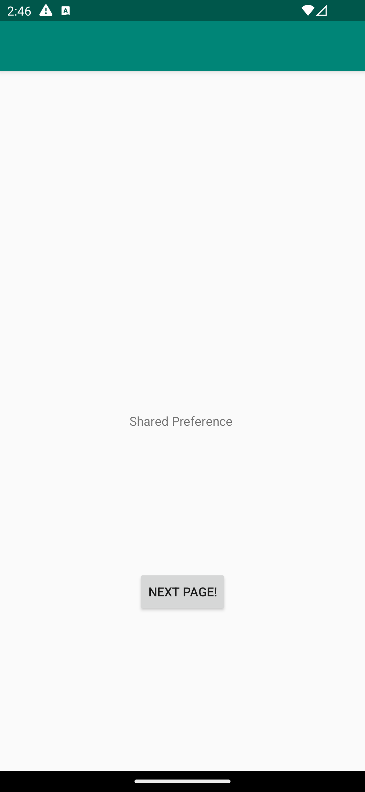
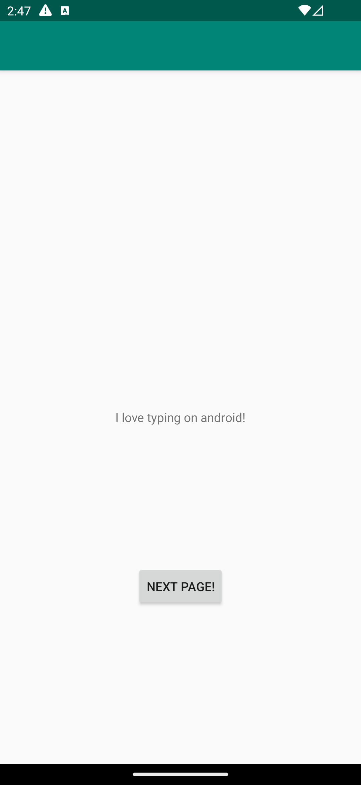
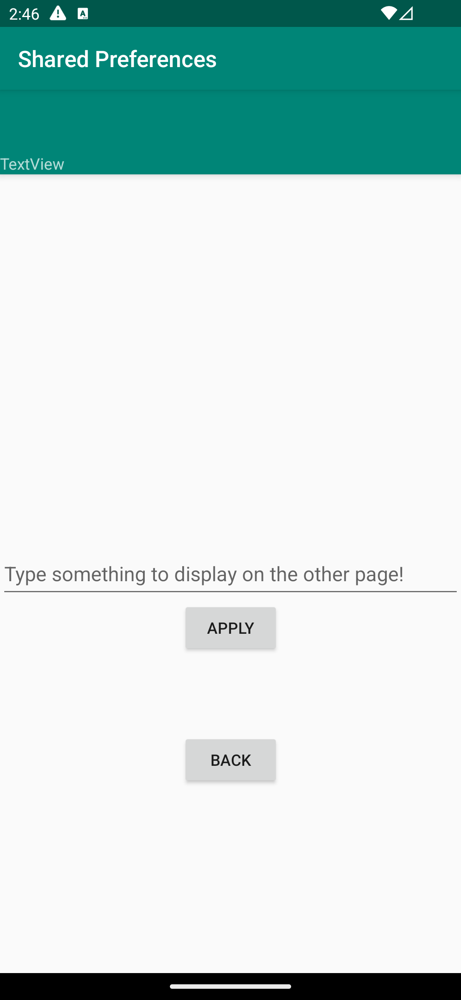
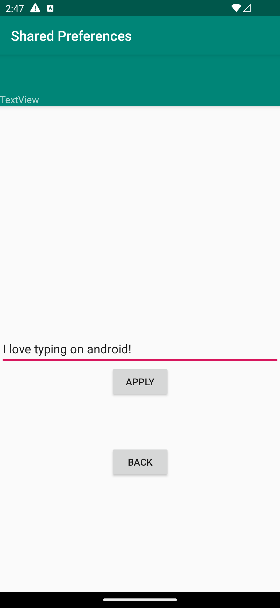

# Rapport

I appen kan data skickas mellan olika activities. 


I MainActivit hämtar vi TextView och knappen. Knappen går till den andra activityn när den klickas på.
```
@Override
protected void onCreate(Bundle savedInstanceState) {
    ...
    textView = (TextView) findViewById(R.id.textView);
    Button button = findViewById(R.id.button);
    button.setOnClickListener(view -> {
        Intent intent = new Intent(MainActivity.this, SecondActivity.class);
        startActivity(intent);
    });
}
```

I SecondActivity finns methoden saveData(), när methoden kallas hämtar den texten skriven i EditText fältet. Genom SharedPreferences skapas det en instans av SharedPreferences.Editor för att redigera värdet i filen. Därefter hämtar den den nya texten från EditText och sparar den till SharedPreferences-filen.
```
public void saveData() {
    SharedPreferences sharedPreferences = getSharedPreferences(changingString, MODE_PRIVATE);
    SharedPreferences.Editor editor = sharedPreferences.edit();
    editor.putString(changingString, editText.getText().toString()).apply();
}

```

Här hämtas den sparade datan från SharedPreferences-filen (`saveData()`) och redigerar data i TextView.
```
@Override
public void onResume() {
    super.onResume();
    SharedPreferences sharedPreferences = getSharedPreferences(SecondActivity.changingString, MODE_PRIVATE);
    String textFromEditView = sharedPreferences.getString(SecondActivity.changingString, "");
    textView.setText(textFromEditView);
}
```

Här är slut produkten:
